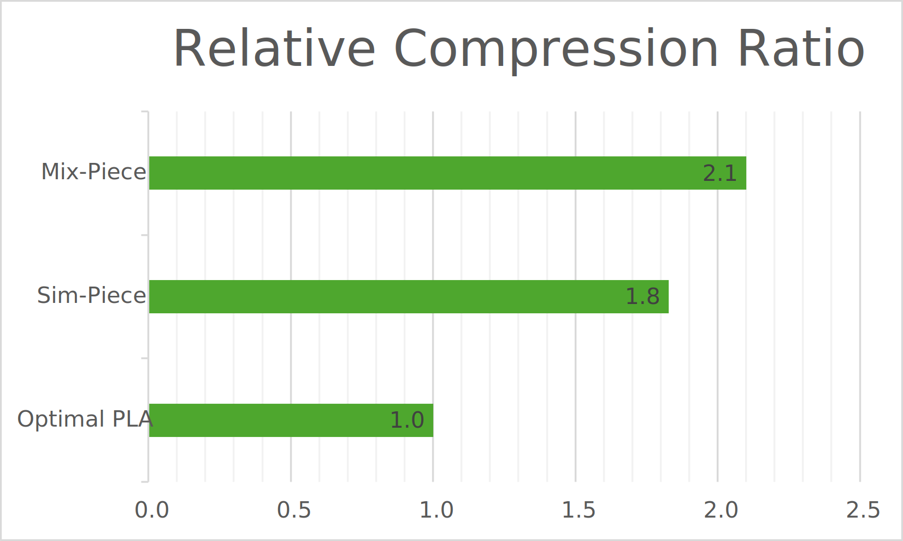

# Mix-Piece / Sim-Piece Library

## Description

Mix-Piece and Sim-Piece are time-series lossy data compressors inspired by Piecewise Linear Approximation (PLA).

The algorithm operates in two stages. In the first stage, an intermediate angle-based PLA representation is constructed. This involves generating disjoint PLA segments, each associated with a quantized starting point and a range of allowable slopes, determined by the error threshold. In the second stage, these intermediate segments are merged and represented together in the final output. During the merging phase, the algorithm calculates the minimum number of shared groups possible. This process leads to a highly compressed representation that is considerably smaller than what an optimal PLA description computed for the same maximum error threshold could achieve.

Mix-Piece builds upon Sim-Piece by better handling time series that include trends. Mix-Piece overall surpasses Sim-Piece in terms of compression time and creates segments with smaller error. **For achieving the best results, make sure you are using Mix-Piece.**

In our algorithm, users apply a maximum absolute error bound to generate a remarkably compact binary representation of a time series using advanced encoding techniques and general-purpose compression via [Zstandard](https://github.com/facebook/zstd).

Mix-Piece and Sim-Piece are particularly suitable for applications requiring efficient handling of large time series datasets, even when the acceptable error threshold is very small.

The following graph illustrates the performance of these algorithms on a diverse range of real datasets, comparing them to the optimal PLA representation for the same maximum error bound.



Moreover, Sim-Piece and Mix-Piece achieve smaller Mean Absolute Error (MAE) and Root Mean Squared Error (RMSE) values than alternative PLA techniques for the same space (see our papers for more details).

## Using the Library

TODO

## Test

If you are interested in testing our algorithms, you can execute the following command on the testing dataset (requires Java SE 8+):

```
mvn test -Dtest=TestPLA
```

The results are for $ 0.5\% \times \text{range} \leq \epsilon \leq 5\% \times \text{range} $. The $range$ is defined as the difference between the maximum and the minimum value of a signal.

### Publications

- **Flexible Grouping of Linear Segments for Highly Accurate Lossy Compression of Time Series Data** (2024)  
  X. Kitsios, P. Liakos, K. Papakonstantinopoulou, Y. Kotidis  
  _The VLDB Journal_  
  DOI: [10.1007/s00778-024-00862-z](https://doi.org/10.1007/s00778-024-00862-z)

- **[Sim-Piece: Highly Accurate Piecewise Linear Approximation through Similar Segment Merging](https://xkitsios.github.io/assets/pdf/simpiece-pvldb23.pdf)** (2023)  
  X. Kitsios, P. Liakos, K. Papakonstantinopoulou, Y. Kotidis  
  _Proceedings of the VLDB Endowment_, Vol. 16, No. 8, pp. 1910-1922  
  DOI: [10.14778/3594512.3594521](https://doi.org/10.14778/3594512.3594521)

## Notes

- If you are interested in lossless time-series compression, you can check out our CHIMP algorithm available at [https://github.com/panagiotisl/chimp](https://github.com/panagiotisl/chimp).

## Who do I talk to?

- [Xenophon Kitsios](https://xkitsios.github.io/)
- [Panagiotis Liakos](https://cgi.di.uoa.gr/~p.liakos/)
- [Katia Papakonstantinopoulou](https://www2.aueb.gr/users/katia/)
- [Yannis Kotidis](https://pages.aueb.gr/users/kotidis/)
